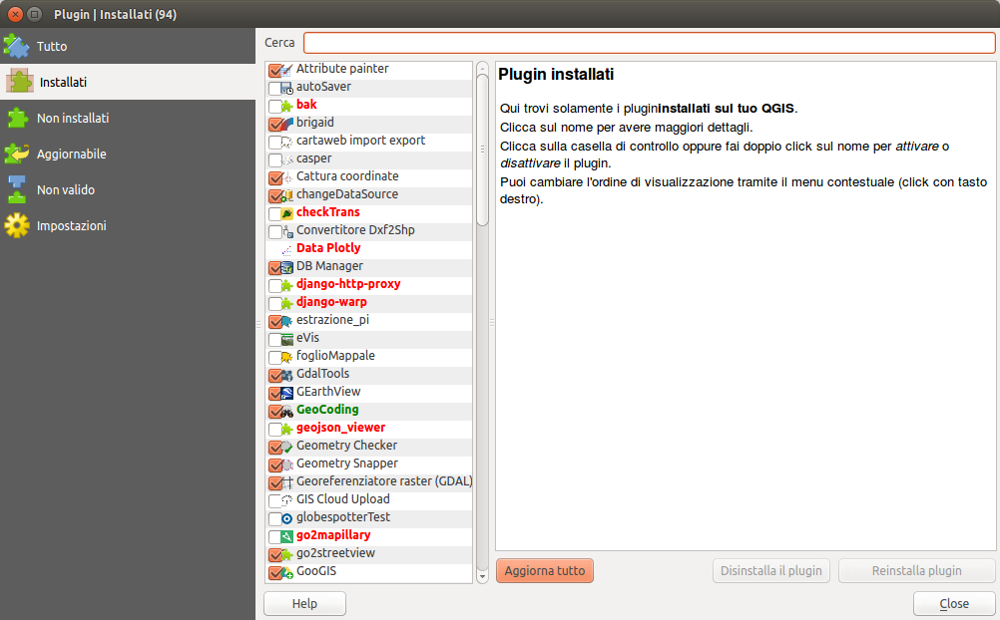
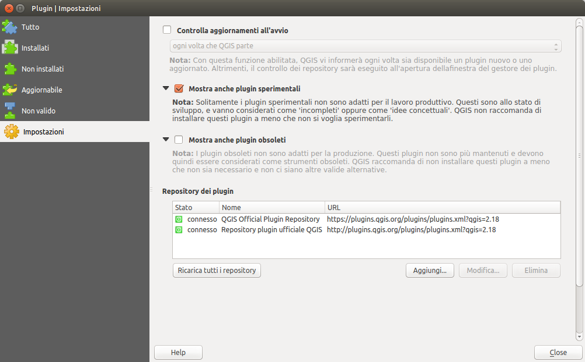
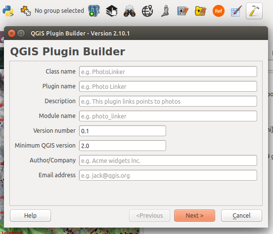
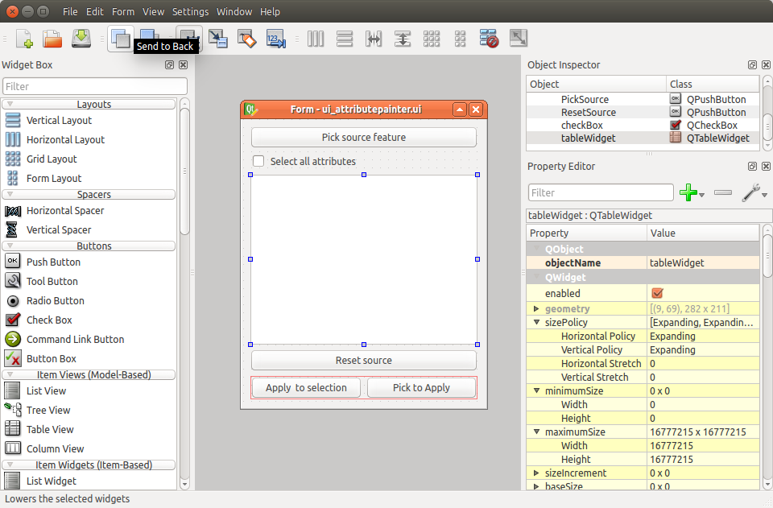
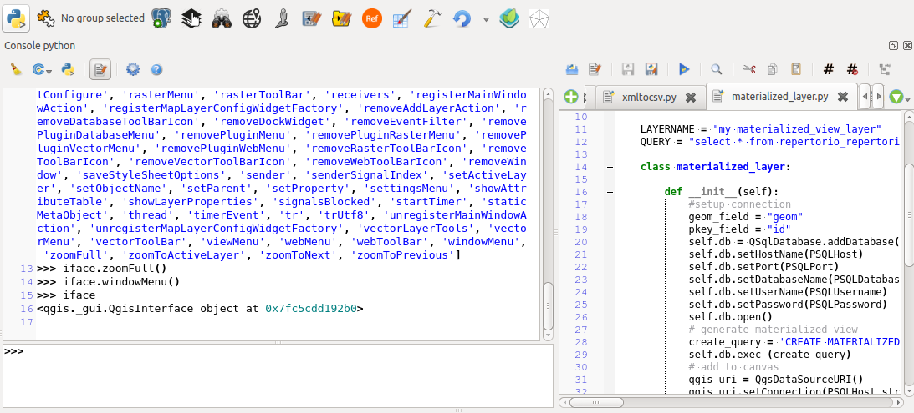

<!-- $theme: default -->

## I PLUGINS PER QGIS
la finestra di dialogo di qgis



---

## il repository di qgis.org

[il Repository ufficiale](http://plugins.qgis.org/plugins/)

Settaggio di repositories alternativi:


---

## Alcuni plugins significativi
* [Photo2Shape](http://plugins.qgis.org/plugins/photo2shape/)
* [openlayers](http://plugins.qgis.org/plugins/openlayers_plugin/) [quickmapservices](http://plugins.qgis.org/plugins/quick_map_services/) XYZprovider
* [ArcGIS REST API Connector](http://plugins.qgis.org/plugins/connector/)
* [Qgis2threejs](https://github.com/minorua/Qgis2threejs)
* [CXFin](http://plugins.qgis.org/plugins/Cxf_in/)
* [Vector bender](http://plugins.qgis.org/plugins/VectorBender/)
* [Select by Relationship](https://github.com/pyarchinit/selectbyrelationship_repo)
* Alcuni plugins necessitano di librerie Python non comprese nella distribuzione
    *Linux e OSX: usare pip per l'installazione dei moduli da (https://pypi.python.org/pypi)
    *Windows non ha pip preinstallato: [tutorial](https://pip.pypa.io/en/stable/installing/#do-i-need-to-install-pip)

---

## Home made plugins
(http://plugins.qgis.org/plugins/user/enricofer/)

* go2streetview
    * un plugin per esplorare google street view direttamente da qgis
    * [acque interne della provincia di venezia](http://acque-interne.provincia.venezia.it/acque-interne/it)
* attributepainter
    * un plugin per attribuire ad una feature destinazione gli attributi di una feature sorgente
* changeDataSource
    * un plugin per cambiare la sorgente dati di un layer già caricato conservandone tutte le proprietà
* layerVersion
    * un plugin per esportare ed importare un'istantanea dell'editbuffer
* pickLayer
    * un plugin per creare un menu contestuale di funzioni a layer o feature
* refFunctions
    * un repertorio di nuove funzioni per il calcolatore di espressioni
* QgisODK
    * un plugin per realizzare sondaggi sul campo con dispositivo mobile a partire da un progetto di QGIS

---

* issue tracker - I metadati dei plugins contengono sempre un campo con l'*[issue tracker](https://github.com/minorua/Qgis2threejs/issues)* E' importante segnalare malfunzionamenti inviando informazioni dettagliate e dataset di esempio che passo dopo passo aiutano il programmatore a riprodurre il problema ed a trovare soluzioni.
* plugin stand-alone - i plugin possono essere installati manualmente copiando la cartella del plugin in una directory contenuta nel profilo utente
[HOME_DIR]/.qgis2/python/plugins - [HOME_DIR] varia a seconda dei sistemi operativi. Possono essere scaricati da (https://github.com/)
* I plugin di qgis devono avere una licenza compatibile con la [GPL V2](http://blog.qgis.org/2016/05/29/licensing-requirements-for-qgis-plugins/)
* risorse in italiano: [pigrecoinfinito](https://pigrecoinfinito.wordpress.com/)

---

## struttura di un plugin

```
PYTHON_PLUGINS_PATH/MIO PLUGIN/
        __init__.py    --> richiesto, punto di partenza del plugin
        mainPlugin.py  --> richiesto, caricato dal metodo classFactory()
        metadata.txt   --> richiesto, contiene info per il repository
        resources.qrc  --> utile/facoltativo contiene immagini e altro
        resources.py   --> versione compilata con pyrcc4
        form.ui        --> utile/facoltativo, definizione della GUI
        form.py        --> versione compilata con pyuic4
```
---

#### plugin builder


E' uno strumento per la compilazione automatica dei files basilari per la realizzazione di un plugin lasciando all'utente la definizione del funzionamento in dettaglio e la definizione dell'interfaccia

---

#### disegnare la GUI con qt_designer

E' uno strumento che permette di creare e modificare l'interfaccia di dialogo con l'utente in modo semplice ed intuitivo

---

#### risorse per la programmazione di un plugin:
* [un plugin minimale] (https://github.com/wonder-sk/qgis-minimal-plugin)
* [un plugin costruito con plugin builder - autosaver] (https://github.com/enricofer/autoSaver)
* [pyqgis cookbook] (http://docs.qgis.org/testing/en/docs/pyqgis_developer_cookbook/)
* [API di QGIS 2.14LTR](http://qgis.org/api/2.14/)
* [API di Qt4](http://doc.qt.io/qt-4.8/modules.html)

---

## LA CONSOLE DI PYTHON



---

### giochiamo con python

```python
a = 10
b = 'ciao'
c = a
print (c)

if a == 10:
    print "VERO!"
else:
    print "FALSO!"

for j in range(0,a):
    print (j)

for c in b:
    print (c)
```

---


### l'oggetto [iface](http://qgis.org/api/2.14/classQgisInterface.html)
```python
iface
```
```python
dir(iface)
```
```python
iface.actionNewProject()
```
```python
iface.mapCanvas()
iface.mapCanvas().extent().asPolygon()
```
```python
a = QgsVectorLayer("path","nome","provider")
```

---

#### Master di II livello in "GIScience e sistemi a pilotaggio remoto per la gestione integrata del territorio e dellerisorse naturali"
#### eSTATE gis 2017
#### Workshop "Geoprocessing in python con QGIS"

#### (C) 2017 Enrico Ferreguti
#### I contenuti sono distribuiti con licenza [CC BY-SA](https://creativecommons.org/licenses/by-sa/3.0/it/) 

* [sezione 1 - introduzione](./workshop_0.html)
* [sezione 2 - estendere QGIS](./estategis_1.html)
* [sezione 3 - il linguaggio Python](./workshop_1.html)
* [sezione 4 - PyQt / PyQGIS](./workshop_2.html)
* [sezione 5 - PyQGIS per esempi](./estategis_2.html)
* [sezione 5 - ESERCITAZIONE](./estategis_3.html)
