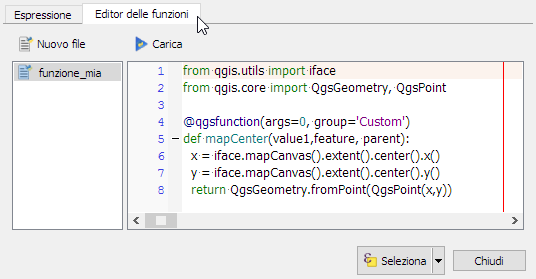
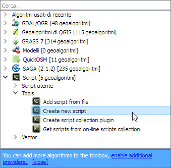
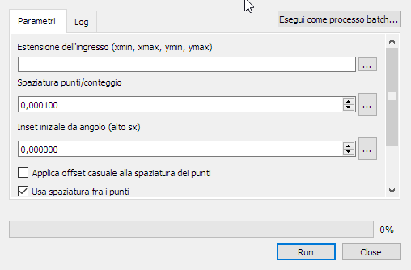
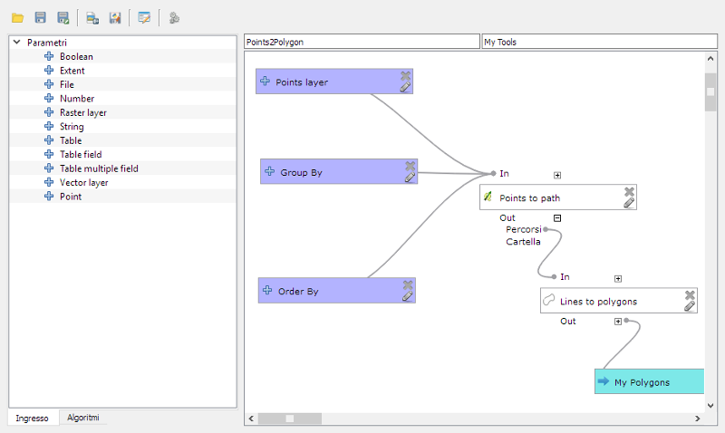
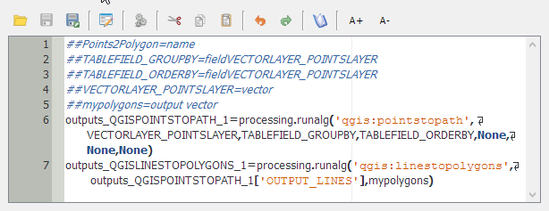

## PyQGIS per esempi
* Plugins
* Script di console
   * Trova tutte le feature multiparte in un layer
   * Cambia la trasparenza del layer corrente
   * informazioni sui layer
   * estrazione degli estremi
* Funzioni personalizzate per il calcolatore di espressioni
	* Funzione che restituisce il punto centrale dello schermo
	* Funzione booleana per testare se una feature è selezionata
* Processing
	* Dai Modelli agli script di Processing
	* Uno script per preparare un grafo per il routing

---

## struttura di un plugin

```
PYTHON_PLUGINS_PATH/MIO PLUGIN/
        __init__.py    --> richiesto, punto di partenza del plugin
        mainPlugin.py  --> richiesto, caricato dal metodo classFactory()
        metadata.txt   --> richiesto, contiene info per il repository
        resources.qrc  --> utile/facoltativo contiene immagini e altro
        resources.py   --> versione compilata con pyrcc4
        form.ui        --> utile/facoltativo, definizione della GUI
        form.py        --> versione compilata con pyuic4
``` 

---

#### plugin builder


E' uno strumento per la compilazione automatica dei files basilari per la realizzazione di un plugin lasciando all'utente la definizione del funzionamento in dettaglio e la definizione dell'interfaccia

---

#### disegnare la GUI con qt_designer

E' uno strumento che permette di creare e modificare l'interfaccia di dialogo con l'utente in modo semplice ed intuitivo

---

#### risorse per la programmazione di un plugin:
* [un plugin minimale] (https://github.com/wonder-sk/qgis-minimal-plugin)
* [un plugin costruito con plugin builder - autosaver] (https://github.com/enricofer/autoSaver)
* [pyqgis cookbook] (http://docs.qgis.org/testing/en/docs/pyqgis_developer_cookbook/)
* [API di QGIS 2.14LTR](http://qgis.org/api/2.14/)
* [API di Qt4](http://doc.qt.io/qt-4.8/modules.html)


---

#### Cambia la trasparenza del layer corrente

[codice](./python/console/set_trasp.py)

```python
def trasp(t=50):
    layer = iface.mapCanvas().currentLayer()
    if layer.layerTransparency() == t:
        layer.setLayerTransparency(0)  # int tra 0 e 100
    else:
        layer.setLayerTransparency(t)
    iface.mapCanvas().refresh()
```

---

#### Percorri un albero di directory

[codice](./python/console/recurse_subdirs.py)

```python
import os

basedir = "/home/enrico/Dropbox/COMMESSE/ACQUE-INTERNE/01_QC"
# in windows le backslash devono essere raddopiate \ -> \\

for root,subfolders,files in os.walk(basedir):
    for file in files:
        filename, extension = os.path.splitext(file)
        if extension == ".shp":
            shp_file = os.path.join(root,file)
            print ("loading layer %s ...") % shp_file
            shp_layer = QgsVectorLayer(shp_file, filename, 'ogr')
            QgsMapLayerRegistry.instance().addMapLayer(shp_layer)
```

---

#### Trova tutte le feature multiparte in un layer

[codice](./python/console/multipart_features.py)

```python
l = iface.activeLayer()
iter = l.getFeatures()
geoms = []
for feature in iter:
    geom = feature.geometry()
    if geom.isMultipart():
        l.select(feature.id())
        geoms.append(geom)

print ('%i multipart features') % len(geoms)
```

---

[codice](./python/console/feat_info.py)
```python
from qgis.core import QGis, QgsPoint
#layer = iface.addVectorLayer("/path.shp", "nome", "ogr")
layer = iface.activeLayer() #caricamento
if not layer or not layer.isValid():
  print "Layer non valido!"
QgsMapLayerRegistry.instance().addMapLayer(layer) #registrazione
informazioni=[]
for feature in layer.getFeatures(): #accesso alle features
    info = [feature.id()]
    geom = feature.geometry()
    if geom.type() == QGis.Point:
        info.append("distanza")
        info.append(geom.distance(QgsPoint(0,0)))
    elif geom.type() == QGis.Line:
        info.append("Lunghezza")
        info.append(geom.length())
    elif geom.type() == QGis.Polygon:
        info.append("Area")
        info.append(geom.area)
    info += feature.attributes()
    informazioni.append(info)
print informazioni
```

---

[codice](./python/console/graph_tree.py)
```python
from qgis.core import QGis, QgsMapLayerRegistry, QgsFeature, QgsVectorLayer

def touchesLayer(point, exclude_id, layer):
    for feature in layer.getFeatures():
        vertex_list = feature.geometry().asPolyline()
        if feature.id() != exclude_id and point.compare(vertex_list[0]) or point.compare(vertex_list[-1]):
            return True
    return False

intersectionLayer = QgsVectorLayer("Point?crs=epsg:3857&field=rif_id:integer", "nodi", "memory")
if layer.geometryType() == QGis.Line:
    features = []
    for feature in layer.getFeatures():
        vertex_list = feature.geometry().asPolyline()
        for node in (vertex_list[0], vertex_list[-1]):
            if touchesLayer(node, feature.id(), layer):
                new_feature = QgsFeature(intersectionLayer.pendingFields())
                new_feature.setAttribute('rif_id',feature.id())
                new_feature. setGeometry(QgsGeometry.fromPoint(node))
                features.append(new_feature)
    intersectionLayer.dataProvider().addFeatures(features)
    QgsMapLayerRegistry.instance().addMapLayer(intersectionLayer)
```

---
## Funzioni personalizzate
In QGIS è possibile creare funzioni personalizzate che possono essere utilizzate nel calcolatore di espressioni:



---

#### Funzione che restituisce il punto centrale dello schermo
[codice](./python/expression/mapcenter.py)
```python
from qgis.utils import iface
from qgis.core import QgsGeometry, QgsPoint

@qgsfunction(args=0, group='Custom')
def mapCenter(value1,feature, parent):
  x = iface.mapCanvas().extent().center().x()
  y = iface.mapCanvas().extent().center().y()
  return QgsGeometry.fromPoint(QgsPoint(x,y))
```

---

#### Funzione booleana per testare se una feature è selezionata
[codice](./python/expression/isselected.py)
```python
from qgis.utils import iface

@qgsfunction(args=0, group='Custom')
def isSelected(value1,feature, parent):
    selected_ids = []
    for f in iface.activeLayer().selectedFeatures()
        selected_ids = f.id()
    return feature.id() in selected_ids
```

---

## Processing
In QGIS è contenuta un'interfaccia molto sofisticata per il geoprocessing che consente l'uso di algoritmi nativi e algoritmi esterni per il processamento di dati a contenuto geo spaziale. Tale libreria si chiama Processing. 
Gli algoritmi di processing prevedono una maschera di input con una serie di dati obbligatori o opzionali e l'indicazione dei layer di output dei risultati.

  | 
---|---

---
## Modelli di processing
Processing è facilmente personalizzabile creando nuovi moduli che assemblano gli algoritmi esistenti in un diagramma di flusso:


---
## Dai Modelli agli script di Processing
i modelli di processing possono venire esportati come script in python soccessivamente modificabili:
```python
##Points2Polygon=name
##TABLEFIELD_GROUPBY=fieldVECTORLAYER_POINTSLAYER
##TABLEFIELD_ORDERBY=fieldVECTORLAYER_POINTSLAYER
##VECTORLAYER_POINTSLAYER=vector
##mypolygons=output vector
outputs_QGISPOINTSTOPATH_1=processing.runalg('qgis:pointstopath', VECTORLAYER_POINTSLAYER,TABLEFIELD_GROUPBY,TABLEFIELD_ORDERBY,None,None,None)
outputs_QGISLINESTOPOLYGONS_1=processing.runalg('qgis:linestopolygons', outputs_QGISPOINTSTOPATH_1['OUTPUT_LINES'],mypolygons)
```
Modelli e Script di Processing possono essere importati dal repository di QGIS

---
## Script utente in Processing
Gli utenti possono facilmente aggiungere uno script di processing in python per eseguire processi usufruendo dell'infrastruttura di processing. Creando o modificando uno script esistente compare la finestra di editing:



---
#### Struttura dello script di processing
Analizziamo uno script di esempio per la generazione di un grafo e nodi per l'analisi dei persorsi
[codice](./python/processing/costruisci_grafo.py)
```python
##Linee=vector line
##nodi=output vector
##grafo=output vector
```
Uno script di processing inizia con la dichiarazione della maschera di interfaccia. 

---

importazione delle classi utilizzate

```python
from qgis.core import QgsGeometry, QgsField, QgsFeature, QGis 
from PyQt4.QtCore import QVariant
from processing.tools.vector import VectorWriter
```
preparazione dei dati di default
```python
linee_layer = processing.getObject(Linee)
grafo_fields = [QgsField("rif_id", QVariant.Int), QgsField("in_id", QVariant.Int), QgsField("out_id", QVariant.Int)]
grafo_writer = VectorWriter(grafo, None, grafo_fields, QGis.WKBMultiLineString, linee_layer.crs())
nodi_fields = [QgsField("nodo_id", QVariant.Int)]
nodi_writer = VectorWriter(nodi, None, nodi_fields, QGis.WKBMultiPoint, linee_layer.crs())
```

---

Individuazione dei vertici degli archi del grafo
```python
i = 0
n = linee_layer.featureCount()
lista_nodi = []
progress.setText("Individuazione dei vertici degli archi del grafo ...")
for k,feature in enumerate(processing.features(linee_layer)):
    progress.setPercentage(int(100*i/n))
    i += 1
    lista_vertici = feature.geometry().asPolyline()
    grafo_feature = QgsFeature()
    attributi =[feature.id()]
    grafo_feature.setGeometry(feature.geometry())
    for campo, estremo in ({1:lista_vertici[0],2:lista_vertici[-1]}).items():
        id_nodo = aggiungi_nodo(estremo)
        attributi.append(id_nodo)
    grafo_feature.setAttributes(attributi)
    grafo_writer.addFeature(grafo_feature)
```

---


Creazione dei nodi e chiusura dello script
```python
i = 0
n = len(lista_nodi)
progress.setText("Creazione dei nodi ...")

for i, nodo in enumerate(lista_nodi):
    progress.setPercentage(int(100*i/n))
    nodo_feature = QgsFeature()
    nodo_feature.setAttributes([i])
    nodo_feature.setGeometry(QgsGeometry.fromPoint(nodo))
    nodi_writer.addFeature(nodo_feature)

del nodi_writer
del grafo_writer
```

---

#### Master di II livello in "GIScience e sistemi a pilotaggio remoto per la gestione integrata del territorio e dellerisorse naturali"
#### eSTATE gis 2017
#### Workshop "Geoprocessing in python con QGIS"

#### (C) 2017 Enrico Ferreguti
#### I contenuti sono distribuiti con licenza [CC BY-SA](https://creativecommons.org/licenses/by-sa/3.0/it/) 

* [sezione 1 - introduzione](./workshop_0.html)
* [sezione 2 - estendere QGIS](./estategis_1.html)
* [sezione 3 - il linguaggio Python](./workshop_1.html)
* [sezione 4 - PyQt / PyQGIS](./workshop_2.html)
* [sezione 5 - PyQGIS per esempi](./estategis_2.html)
* [sezione 5 - ESERCITAZIONE](./estategis_3.html)
