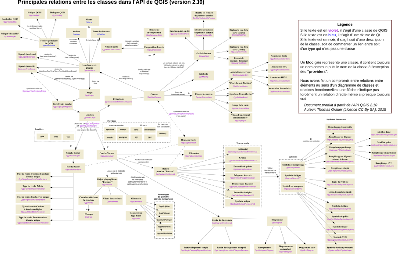

## PyQt e PyQGIS
QGIS è un'applicazione open source multipiattaforma (è disponibile per tutti i principali sistemi operativi) costruita per mezzo del framework di programmazione Qt 
QGIS espone per mezzo di un'interfaccia di programmazione (API) le classi ed i metodi di funzionamento, 
Qt e QGIS dispongono di librerie di collegamento a PYTHON (*bindings*) denominate PyQt e PyQGIS che consentono il controllo e la propgrammazione dell'applicazione per mezzo di codice interpretato in python
* QGIS2
	* Python 2.7/Qt 4
* QGIS3
   * Python 3.5/Qt 5
   
---
## Qt

Qt è un framework applicativo open-source sviluppato da Nokia per costruire interfacce utente grafiche (GUI) e sviluppare software. Qt è utilizzato in programmi come Google Earth, Virtual Box, Skype, Autodesk e Android. QGIS stesso è costruito con Qt. L'utilizzo di un framework applicativo come Qt velocizza il ciclo di sviluppo di un'applicazione e consente di sviluppare applicazioni multi-piattaforma.
### PyQt
il modulo di collegamento (*bindings*) si chiama PyQt e può essere importato in un programma Python per controllare i widget dell'interfaccia utente
[moduli di Qt](http://doc.qt.io/qt-4.8/modules.html)
[API di PyQt](http://pyqt.sourceforge.net/Docs/PyQt4/modules.html)

---
## qt designer

---

## API di QGIS

[diagramma](https://raw.githubusercontent.com/webgeodatavore/qgis-class-diagram/master/diagramme_principal.png)

---
## PyQGIS - classi fondamentali

* [QgisInterface](https://qgis.org/api/classQgisInterface.html): riferimenti dell'interfaccia utente:
* [QgsProject.instance()](https://qgis.org/api/classQgisInterface.html): è un oggetto singolare (singleton) e gestisce l'oggetto progetto corrente
* [QgsMapLayerRegistry.instance()](https://qgis.org/api/2.18/classQgsMapLayerRegistry.html): gestisce il registro dei layer caricati, in QGIS3 è incorporato in QgsProject()
* [QgsMapCanvas()](https://qgis.org/api/classQgsMapCanvas.html): è accessibile da QgisInterface().mapCanvas() e gestisce la visualizzazione dei layer: sistemi di riferimento, zoom/pan, mapTools etc...
* [QgsLayerInterface()](http://qgis.org/api/2.18/classQgsLegendInterface.html): accessibile da QgisInterface().layerInterface() gestisce la legenda dei layers
* [QgsMapLayer()](https://qgis.org/api/classQgsMapLayer.html): si articola in QgsVectorLayer() e QgsRasterLayer() e gestisce la manipolazione dei layers
* [QgsFeature()](https://qgis.org/api/classQgsFeature.html): gestione delle singole entità in geometria e attributi
* [QgsGeometry()](https://qgis.org/api/classQgsGeometry.html): permette la manipolazione delle geometrie

---

#### Master di II livello in "GIScience e sistemi a pilotaggio remoto per la gestione integrata del territorio e dellerisorse naturali"
#### eSTATE gis 2017
#### Workshop "Geoprocessing in python con QGIS"

#### (C) 2017 Enrico Ferreguti
#### I contenuti sono distribuiti con licenza [CC BY-SA](https://creativecommons.org/licenses/by-sa/3.0/it/) 

* [sezione 1 - introduzione](./workshop_0.html)
* [sezione 2 - estendere QGIS](./estategis_1.html)
* [sezione 3 - il linguaggio Python](./workshop_1.html)
* [sezione 4 - PyQt / PyQGIS](./workshop_2.html)
* [sezione 5 - PyQGIS per esempi](./estategis_2.html)
* [sezione 5 - ESERCITAZIONE](./estategis_3.html)