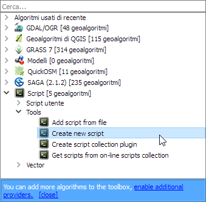
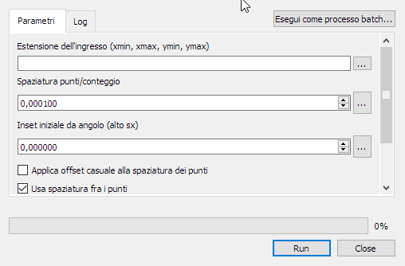
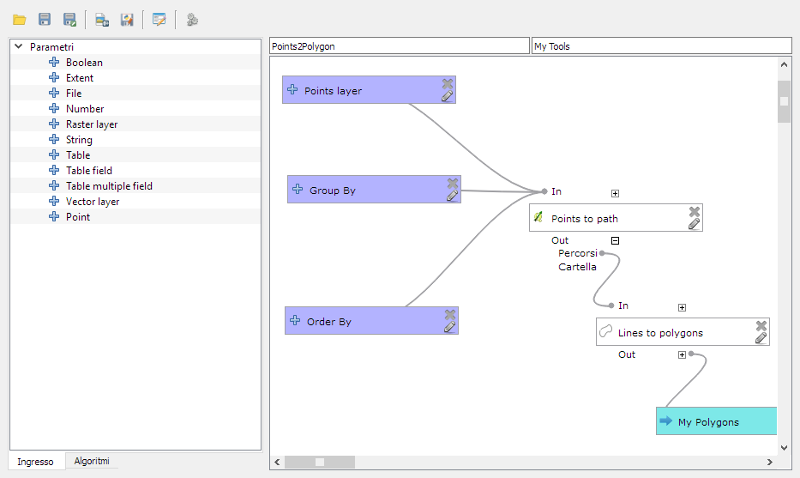
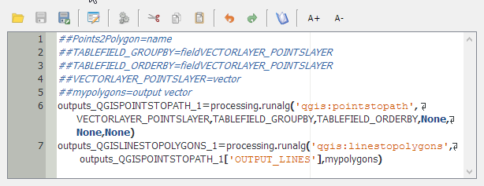

## PyQGIS per esempi
* Script di console
   * Trova tutte le feature multiparte in un layer
   * Cambia la trasparenza del layer corrente
   * informazioni sui layer
   * estrazione degli estremi
* Funzioni personalizzate per il calcolatore di espressioni
	* Funzione che restituisce il punto centrale dello schermo
	* Funzione booleana per testare se una feature è selezionata
* Processing
	* Dai Modelli agli script di Processing
	* Uno script per preparare un grafo per il routing
* Plugins

---
## Trova tutte le feature multiparte in un layer
```python
l = iface.activeLayer()
iter = l.getFeatures()
geoms = []
for feature in iter:
    geom = feature.geometry()
    if geom.isMultipart():
        l.select(feature.id())
        geoms.append(geom)

print ('%i multipart features') % len(geoms)
```

---
## Cambia la trasparenza del layer corrente
```python
def trasp(t=50):
    layer = iface.mapCanvas().currentLayer()
    if layer.layerTransparency() == t:
        layer.setLayerTransparency(0)  # int tra 0 e 100
    else:
        layer.setLayerTransparency(t)
    iface.mapCanvas().refresh()
```

---
```python
from qgis.core import QGis, QgsPoint
#caricamento
#layer = iface.addVectorLayer("/path.shp", "nome", "ogr")
layer = iface.activeLayer()
if not layer:
  print "Layer non valido!"
#registrazione
QgsMapLayerRegistry.instance().addMapLayer(layer)
#accesso alle features
informazioni=[]
for feature in layer.getFeatures():
    info = [feature.id()]
    geom = feature.geometry()
    if geom.type() == QGis.Point:
        info.append("distanza")
        info.append(geom.distance(QgsPoint(0,0)))
    elif geom.type() == QGis.Line:
        info.append("Lunghezza")
        info.append(geom.length())
    elif geom.type() == QGis.Polygon:
        info.append("Area")
        info.append(geom.area)
    info += feature.attributes()
    informazioni.append(info)
print informazioni
```

---
```python
from qgis.core import QGis, QgsMapLayerRegistry, QgsFeature, QgsVectorLayer

def touchesLayer(point, exclude_id, layer):
    for feature in layer.getFeatures():
        vertex_list = feature.geometry().asPolyline()
        if feature.id() != exclude_id and point.compare(vertex_list[0]) or point.compare(vertex_list[-1]):
            return True
    return False

intersectionLayer = QgsVectorLayer("Point?crs=epsg:3857&field=rif_id:integer", "nodi", "memory")
if layer.geometryType() == QGis.Line:
    features = []
    for feature in layer.getFeatures():
        vertex_list = feature.geometry().asPolyline()
        for node in (vertex_list[0], vertex_list[-1]):
            if touchesLayer(node, feature.id(), layer):
                new_feature = QgsFeature(intersectionLayer.pendingFields())
                new_feature.setAttribute('rif_id',feature.id())
                new_feature. setGeometry(QgsGeometry.fromPoint(node))
                features.append(new_feature)
    intersectionLayer.dataProvider().addFeatures(features)
    QgsMapLayerRegistry.instance().addMapLayer(intersectionLayer)
```

---
## Funzioni personalizzate
In QGIS è possibile creare funzioni personalizzate che possono essere utilizzate nel calcolatore di espressioni:


---
## Funzione che restituisce il punto centrale dello schermo
```python
from qgis.utils import iface
from qgis.core import QgsGeometry, QgsPoint

@qgsfunction(args=0, group='Custom')
def mapCenter(value1,feature, parent):
  x = iface.mapCanvas().extent().center().x()
  y = iface.mapCanvas().extent().center().y()
  return QgsGeometry.fromPoint(QgsPoint(x,y))
```

---
## Funzione booleana per testare se una feature è selezionata
```python
from qgis.utils import iface

@qgsfunction(args=0, group='Custom')
def isSelected(value1,feature, parent):
    selected_ids = []
    for f in iface.activeLayer().selectedFeatures()
        selected_ids = f.id()
    return feature.id() in selected_ids
```

---
## Processing
In QGIS è contenuta un'interfaccia molto sofisticata per il geoprocessing che consente l'uso di algoritmi nativi e algoritmi esterni per il processamento di dati a contenuto geo spaziale. Tale libreria si chiama Processing. 
Gli algoritmi di processing prevedono una maschera di input con una serie di dati obbligatori o opzionali e l'indicazione dei layer di output dei risultati.

  | 
---|---

---
## Modelli di processing
Processing è facilmente personalizzabile creando nuovi moduli che assemblano gli algoritmi esistenti in un diagramma di flusso:


---
## Dai Modelli agli script di Processing
i modelli di processing possono venire esportati come script in python soccessivamente modificabili:
```python
##Points2Polygon=name
##TABLEFIELD_GROUPBY=fieldVECTORLAYER_POINTSLAYER
##TABLEFIELD_ORDERBY=fieldVECTORLAYER_POINTSLAYER
##VECTORLAYER_POINTSLAYER=vector
##mypolygons=output vector
outputs_QGISPOINTSTOPATH_1=processing.runalg('qgis:pointstopath', VECTORLAYER_POINTSLAYER,TABLEFIELD_GROUPBY,TABLEFIELD_ORDERBY,None,None,None)
outputs_QGISLINESTOPOLYGONS_1=processing.runalg('qgis:linestopolygons', outputs_QGISPOINTSTOPATH_1['OUTPUT_LINES'],mypolygons)
```
Modelli e Script di Processing possono essere importati dal repository di QGIS

---
## Script utente in Processing
Gli utenti possono facilmente aggiungere uno script di processing in python per eseguire processi usufruendo dell'infrastruttura di processing. Creando o modificando uno script esistente compare la finestra di editing:



---
## Struttura dello script di processing
Analizziamo uno script di esempio per la generazione di un grafo e nodi per l'analisi dei persorsi
```python
##Linee=vector line
##nodi=output vector
##grafo=output vector
```
Uno script di processing inizia con la dichiarazione della maschera di interfaccia. 

---
```python
from qgis.core import QgsGeometry, QgsField, QgsFeature, QGis 
from PyQt4.QtCore import QVariant
from processing.tools.vector import VectorWriter
```
importazione delle classi utilizzate

```python
linee_layer = processing.getObject(Linee)
grafo_fields = [QgsField("rif_id", QVariant.Int), QgsField("in_id", QVariant.Int), QgsField("out_id", QVariant.Int)]
grafo_writer = VectorWriter(grafo, None, grafo_fields, QGis.WKBMultiLineString, linee_layer.crs())
nodi_fields = [QgsField("nodo_id", QVariant.Int)]
nodi_writer = VectorWriter(nodi, None, nodi_fields, QGis.WKBMultiPoint, linee_layer.crs())
```
preparazione dei dati di default

---
```python
from qgis.core import QgsGeometry, QgsField, QgsFeature, QGis 
from PyQt4.QtCore import QVariant
from processing.tools.vector import VectorWriter
```
importazione delle classi utilizzate

```python
linee_layer = processing.getObject(Linee)
grafo_fields = [QgsField("rif_id", QVariant.Int), QgsField("in_id", QVariant.Int), QgsField("out_id", QVariant.Int)]
grafo_writer = VectorWriter(grafo, None, grafo_fields, QGis.WKBMultiLineString, linee_layer.crs())
nodi_fields = [QgsField("nodo_id", QVariant.Int)]
nodi_writer = VectorWriter(nodi, None, nodi_fields, QGis.WKBMultiPoint, linee_layer.crs())
```
preparazione dei dati di default

---

#### Master di II livello in "GIScience e sistemi a pilotaggio remoto per la gestione integrata del territorio e dellerisorse naturali"
#### eSTATE gis 2017
#### Workshop "Geoprocessing in python con QGIS"

#### (C) 2017 Enrico Ferreguti
#### I contenuti sono distribuiti con licenza [CC BY-SA](https://creativecommons.org/licenses/by-sa/3.0/it/) 

* [sezione 1 - introduzione](./workshop_0.html)
* [sezione 2 - il linguaggio Python](./workshop_1.html)
* [sezione 3 - PyQt / PyQGIS](./workshop_2.html)
* [sezione 4 - PyQGIS per esempi](./workshop_3.html)